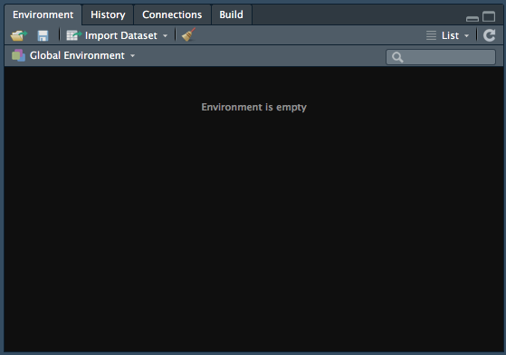

```{r setup, include=FALSE}
knitr::opts_chunk$set(echo = TRUE)
```

# What are R and RStudio IDE? 

## R  <br>

R is a programming language and completely free software which widely used for data analysis across many disciplines. It is a stand-alone program and can be run on it's own, but it's not particularly user friendly. <br> <br>

When you open R alone you get the "R commander" which can be seen below: <br>

<center>  </center> <br>

## RStudio IDE  <br>

RStudio IDE (short for **I**ntegrated **D**evelopment **E**nvironment) is essentially a shiny facade for R, which sits atop it and gives it all sorts of useful features which make it much easier to use. 
RStudio has to be installed in addition to R!

When you first open it you get 3 main panels, which can be seen in the picture below.

<center>  </center> <br> <br>

### 1. Console

This is essentially the same thing as R commander. You can run code in here and it can be a useful playground to try out new things and do things that you don't neccessarily want saved into a script because **it's not permanent- anything typed here will be lost when you close R**!

Examples of things you might want to run in the console include, but are not limited to, experimenting with running new functions and seeing what they do, accessing help topics or installing packages. 

When you run code from a script it appears in the console automatically. Here's a screenshot of my console after making this web page:

<center>  </center><br>

The code is saved in my RMarkdown file and remains there, the console only displays that it was run.

### 2. Environment/History/Connections

This panel is tabbed, with 2 tabs that you should know about to right now:

- **Environment**: this contains all of the virtual "objects" that you have created. These include, but are not limited to, variables containing data that you have read in from data files, lists, individual values, custom-written functions etc.

    Objects can and should be created in your scripts. When you close R you might lose some of the objects, but as long as you have the script containing the instructions to re-create these objects you can re-run it and make them again.

- **History**: this is a list of all of the commands that you have run in the current "session", which can be useful to go back to some times if you did run some code in the console that you want to look at again. This information can also be accessed in the console by placing the cursor there and using the up and down keys.

At this point you don't really need to worry about the one called connections (it lets you connect to things like online data sources and stuff).

This is what the environment panel looks like for me right now... it's empty!

<center>  </center><br>

### 3. Files/Plots/Packages/Help/Viewer

This panel set is going to be mega useful to you throughout the duration of your career as an R user. Viewer is not immediately required, so we'll just cover Files, Plots, Packages and Help.

- **Files**: Shows a file browser that let's you look around in your file structure. Helpful hint: click on the more button and "Go to working directory" to see the same files that R can see. **It is *possible* to load files in through this tab, but you should always strive to do it in the script!** When your homework is assessed we want it in the script.

- **Plots**: A tab that displays plots that you have made (if you don't have them appearing "inline" in a markdown document or do them in a script). You can navigate backwards and forwards between multiple plots- allowing you to test out new things and see the changes in comparison to each other.

- **Packages**: This allows you to look at the R packages that are installed on the machine that you are using, and the check box next to it indicates if it is loaded in from the library. **It is *possible* to click the box to load a package, but you should always strive to do it in the script!** When your homework is assessed we want it in the script.

- **Help**: this window displays the built in help files. Other programs also have this sort of thing, like Microsoft Word or Powerpoint. You can search using the search box on the help tab itself, but you can also type into the console. For example, if I wanted to find the help file for the `library()` function I would type `?library` into the console. the result is displayed in the help tab to the right.

<center>  </center><br>

This can be super helpful, but sometimes these files are not exactly written in a manner that could be considered accessible to novice users. You get the hang of reading them over time. If you struggle to read them right now you might want to try Googling it (we **all** do it, no matter our level of experience). 

Even Googling can be difficult sometimes, but you will eventually get a better idea of the types of search terms and keywords most likely to direct you to the information that you are after. <br><br>
    
<center>  </center> <br>

# File Types

When you open a program, such as Microsoft Word, you haven't actually created a Word document you've just started the program. Opening RStudio is much the same. Even though it can function without opening a file doing so makes life so much easier! 

When you open a file, the console will shrink and the space taken away in that pane will be taken up by the new file.

Opening a new file allows you to write code that can be saved, amended, shared etc. **Analysis code sharing is an important aspect of reproducibility!** If someone wants to see our analysis, or replicate our study with a new population or stimuli or change the paradigm, this takes a lot of the guess work out of what was actually done with the data. It increases *transparency*.

R can handle a lot of different files types, we will only focus on the two kinds that we learned about in the first semester. These are **.r** and **.Rmd** files. Both are saved as plain text files (without any fancy formatting- like the difference between .txt and .docx files). What changes is how R interprets the files, and the types of outputs that you can get from them.

I find it useful to think about these two files in terms of their intended audience, with **.r files intended to be read by the computer** and **.Rmd files more aimed towards humans**.

## .r Files

This is what we refer to as a script. It is designed to be read by R, not so much by humans. 

<center>  </center> <br>

All of the text in an R script will default to being read as **executable code (that is, text which is directed at the machine)**. We can, however, tell R **not** to read it as executable code, but instead for the machine to ignore certain parts of it, by using something called **comments**.

### Comments

```{r comment_example}
# this is what a comment looks like. Anything AFTER a hashtag.
# Code and comments can appear on the same line as code, but comments must
# be placed on the end of the line after a hashtag.

# R doesn't "speak" natural languages so it would not be able 
# to understand any of this and would give errors!

# Comments are for humans. You can use them to put notes in scripts to
# remind yourself of what is happening, or to inform people with whom
# you have shared your code.
```

## .Rmd files

Otherwise known as "R Markdown" files, these are the types of files that you have been downloading and using for your homeworks. It's the type of file I wrote all of this on. They can be extremely useful if you learn to use them well. 

<center>  </center> <br>

I like to think of the way this file type is interpreted as being *like a script, but flipped*- **the default interpretation of text aimed at humans**. If we want executable code we need to prompt R to read the text in this way. This is done using **"code chunks"**, or sometimes just called **"chunks"**.

When you first open a new R Markdown file it already has text and a few code chunks as an example. Here you can see the code chunks are a shaded differently than the rest of the file. Text other than that in the top most part between the sets of dashes (called the **YAML Header**), the code chunks and some other special cases (which we will cover later in your degree), are ignored by R.

___

I have changed the appearance of my IDE to make it easier for me to read (which can be done in **Tools > Global Options > Appearance**). You might also want to change these options if you experience issues, such as colour-blindess. Explore the options to see what works for you!

___

Code chunks can also be spotted by other defining features which are discussed below.

<center>  </center> <br>

### Code Chunks

**Code chunks** are bordered by **"backticks"**, which look an awful lot like apostrophes but they are different! These are important as they tell R where it needs to start and stop reading. 

Chunks also contain **"curly brackets"** at the start which contains various bits of information neccessary to how the computer reads it. This includes what programming language you are writing in there (yes! R Markdown documents can accept other programming languages), name of the chunk (used for a variety of reasons, such as our marking software and document indexing) and other attributes which you will learn about in years to come. 

<center>  </center> <br>

___

One consistent error from the semester 1 homeworks was changing essential chunk parts. Main issues of concern were:

- The chunk **must** have the backticks to show the beginning and end of the executable code, otherwise the code doesn't run and the answer is returned as incorrect and must be double checked.
- Changing the name of the chunk! We use computer assisted marking techniques, and if the chunk name isn't what the answer key is looking for then the question is returned as incorrect because it does't seem to exist, and again needs double checking.

___

# Saving your file

As mentioned before, **anything in the console vanishes when you close R**. Any objects that you have used code to make (those things that live in the environment) should vanish too if R is set up in a maximally reproducible way.

Your script is a set of instructions on how to make those objects. If you have saved your script or markdown, you can essentially re-run it and get back to where you left off when you last saved your progress. 

Saving your file for the first time is as easy as going to **File > Save As** and filling in the details in the dialogue box as appropriate, just like you do in other programs:

<center>   </center> <br>

Saving changes to an already existing file is done by going to **File > Save**:

<center>  </center> <br>

___

Now that we know how to navigate the environment, let's learn how to do something useful with it!

<center> [Next: Basics > Sessions, Directories, Functions and Packages](packages.html) </center>
