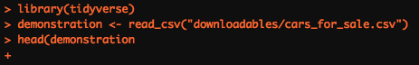

<script src="reveal_extra.js"></script>

```{r setup, include=FALSE}
knitr::opts_chunk$set(echo = TRUE)
```

# Text Outputs from R

Occassionally R will return some text when you run a piece of code. Often, this text is coloured red, which causes a bit of panic in new users. It is printed in the console, but also may be displayed below code chunks in R Markdown documents.

**Not all red text indicates an error!** There are a number of things that R could be trying to tell you, all that the red colour indicates is that you should be paying attention to it.

Let's have a look at what different types of thing R could be telling you.

# Types of Text Output

## Errors

Defintely the one that people worry about the most, but error messages given information about what has gone wrong. By reading and interpretting these messages we can diagnose the problem and fix it- a process called **debugging**. Let's do something that will definitely generate an error and have a look at it:

```{r error=TRUE}
demo <- read_cvs("some_file_name.csv")
```

Breaking it down:

- `Error...`: error messages are always preceeded by the word error
- `could not find function "read_csv"`: the content of the error message. In this case the function I have tried to call is not found. 

**Error messages should give a hint as to what has gone wrong**. You will gain more experience in reading and interpretting these messages over time, most of us have just seen them a lot in our own work and have become accustomed to it!

Trying to run a piece of code that results in an error will not produce any output, besides the error message.

### Common Errors and What They Mean

#### Unexpected ')'

```{r error=TRUE}
library(tidyverse))
```

What does the error message tell you? What happened and what do you think I should do to fix it?

#### Could not find function

```{r error=TRUE}
demonstration <- read_cvs("downloadables/cars_for_sale.csv")
```

This is the same example as the top of the page. What do you think it means? How is it fixed?

#### Could not find object

```{r error=TRUE}
head(demonstration)
```

Same thing here. I've tried to use the function head on the object I tried to create above. Have a think about why this error has been returned and how to fix it. 

#### Could not find object II

To further complicate matters the same error message can be the result of different things that have gone wrong. Look at this, it's the same error message!

```{r error=TRUE}
head(Demonstration)
```

In the labs this happened a lot, so this should be fairly familiar. Assuming that the errors with `read_csv` and `library` have been fixed, why wouldn't this work and how do you fix it?

#### Code wont run, + in the console

```{r eval=FALSE}
demonstration <- read_csv("downloadables/cars_for_sale.csv"
```

This error appears in the console as below:

<center></center>

What has happened? How do I fix it?

### Multiple Errors

If you have an error in your script on an earlier line, and have code later which depends on the success of running this earlier line, then you are also going have problems. Later code which might otherwise work would be missing a key component which would cause errors further down.

Sometimes finding the source of an error requires you to go back to look through your code, keep this in mind when debugging!

For example: `libraary(tidyverse)` fails to load the appropriate package containing the function we need (`read_csv()`), which then means we do not load the data file we want.

You can help prevent this sort of thing from happening by running all lines of code individually, rerunning later code after you've made changes to earlier code and periodically restarting the R session.

## Warnings

Warnings are something different than error messages. Normally we expect code to *either* **work** or **not work**... warnings indicate a third option- that it *kinda* worked.

<center>*-Still seeking simple example-*</center> 
