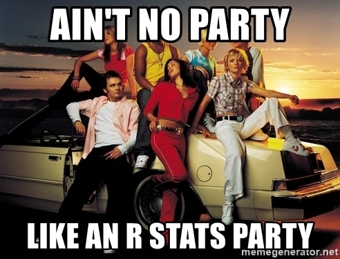
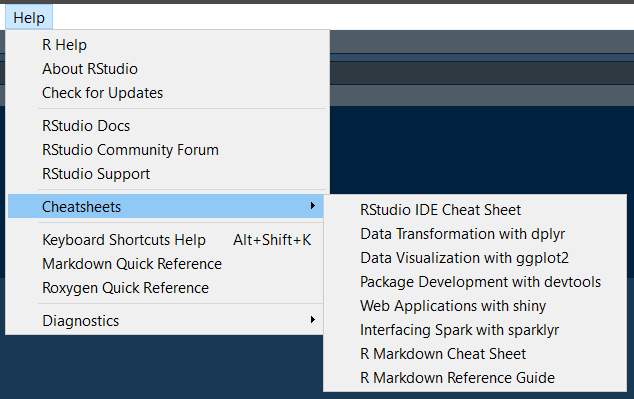

## Purpose of this site

Welcome to Rebecca's revision website for the practical component to the Psychology level 1 labs. This is a personal project of mine, not officially adopted by the teaching team but for the most part they are aware that it exists. 

The site is very much under construction, so patience please! You have your Moodle Forums, Slack Channels, lab leaders and GTAs for questions. Changes will be logged at the bottom of this page.

Based on the general feedback from the homeworks completed in 1A and feeback from teaching staff we have compiled this to serve as revision materials for those wishing to fortify and deepen understanding of the skills developed so far. It also allows those joining us for 1B to catch up on the materials missed in the first semester.

Feedback is important. It allows us to reflect on our past performances and adapt to enhance our future performance. That goes for us as much as it does for you- so if you have any additional information for me please feel free to click on the "Feedback" button on the top right of the screen.  

  
  

Occassionally we might refer to the "cheatsheets". These are reference materials provided by the RStudio team which can be directly accessed via `Help > Cheatsheets`.  

  
  

## Layout

### Basics of RStudio

There are a couple of pages that go into the basics of the RStudio environment. These are under the "Basics" tab at the top of the page.

### Functions

We will also cover the functions that we learned about in the labs in semester 1. Each of those has its own page under the "Functions we used" tab, with a look at the help entries for each so that we can become accustomed to reading and using them. 

### Extras

These pages contain the additional information that you can use to level up your RStudio skills. These are things that will be covered in the labs later as you progress through Psychology levels, but becoming aware of their existence early wont hurt. 

### Tasks

I have made some practice tasks, anyone can have a bash at these and check their responses against the solutions (which are provided). Be honest with yourself, it's the best way to proceed and learn!

I plan to add more of these as I go, but as this is a personal project done in my own personal time it might be a little delayed!

## Change Log

Changes that have been made for those who don't want to wade through the Github versions.

Date      | Change
----------|-----------------------------------------------------------------------------
31-1-19   | Cars task page clarifications, typos in pipes corrected, changelog addition, reorganising by semesters 1 and 2.