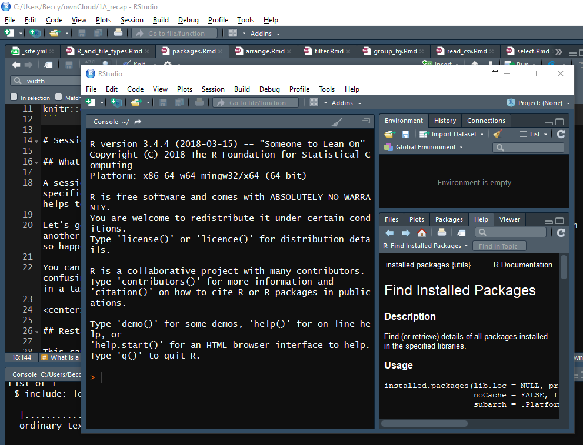
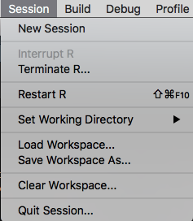
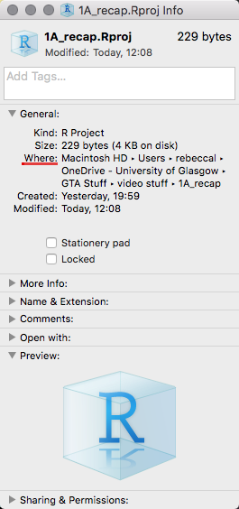
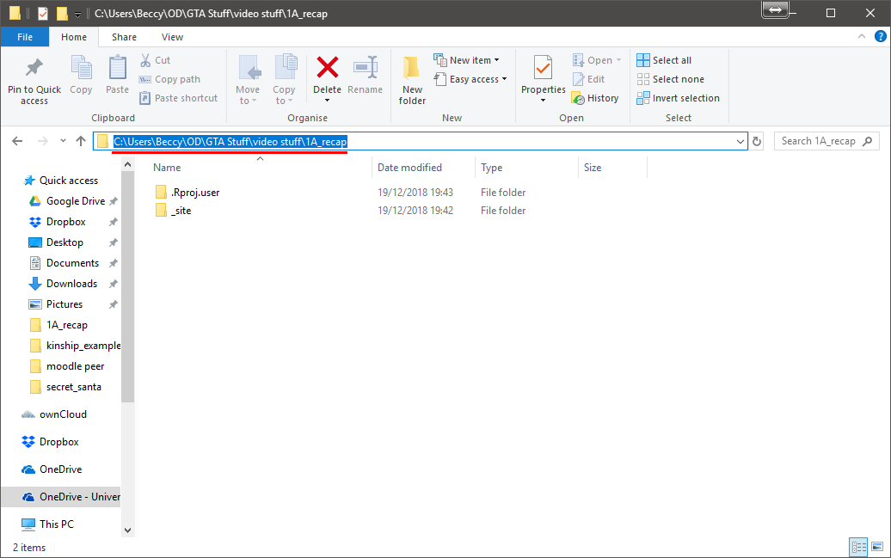
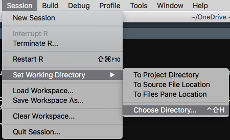

<script src="reveal_extra.js"></script>

```{r setup, include=FALSE}
knitr::opts_chunk$set(echo = TRUE)
```

# Sessions

## What is a session in R?

A **session** in R is a segment of time/workspace/processor time that is dedicated to performing a specific processing or analysis task. It can be difficult to wrap your head around at first, but it helps to draw comparisons with software that we are already familiar with.

Let's go back to Microsoft Word as an example. We can have an essay open in one window and class notes opened up in another window. Both are instances of Word, but they are dedicated to two different tasks (essay as one and class notes as the other) which just so happen to be running concurrently.

<center>  </center> <br>

You can have multiple sessions open in R, but I wouldn't recommend it because it can become confusing. We can start a new session by going to Session > new session. 

Right now, we are much more interested in a task which is closely linked to this idea- restarting your current session!

<center>  </center> <br>

## Restarting Your Current Session

This can be done by going to **Session > Restart R**, see the image above.

Restarting your R session does some important things:

* it clears the environment of objects if R is set up in a maximally reproducible way- so make sure your script is saved so that you keep the instructions for making them again. If all goes well you can recreate all of the objects by running the code again.
* it "unloads" packages that you have called from the library using the `library()` function.
* If you encounter an error with an unknown source sometimes restarting the session can clear the problem- sometimes there can be objects in the environment which are hidden and can cause problems.
* It allows you to test the reproducibility of the script that you are writing by clearing the environment and starting over with only the instructions you have provided, without the possibility of "contamination" of objects inadvertently created in other ways, such as playing in the console.

# Working Directory

## What is a directory?

A **directory** is a technical term that we use for a location on your computer's filing system. These are important because the machine needs to know how to access the files stored within it. 

These are commonly represented by a file **"path"**, which essentially tells you where items are located. These can be found by pressing **Command + i** in Mac OS Finder, or the **navigation bar** in a Windows Explorer window.

Here is the folder from my OneDrive cloud storage accessed on both my Mac and my Windows PC. Notice how the paths differ... they are on different machines!

<center>   </centre> <br>

___

**This difference in paths is why we don't set the working directory in the script, but rather do it manually. **

**If we share our code between different users, or in my case my work and home computers with the same user, the files don't always have the same paths!**

___

## What is the working directory?

The **working directory** is the current directory in which you are working, which should contain all of the files that you currently need to work with. I think about it in terms of communicating...

Imagine I want to speak to my supervisor. I can stand in my office and talk, but that wont work. If I want to speak to her, I need to go to her office. In the same way, R needs to go to the same location of the files, otherwise it's in an empty room talking to itself just like me.

## Setting the working directory

We can move R into the same room as the files that we want to use by setting the working directory by going to **Session > Set Working Directory > Choose Directory**, as below:

<center>  </center> <br>

___

**Note**: it is good practice to group all files for a project in the same directory, for the sake of organisation. If your script or RMarkdown file is already located within the desired working directory, you can select **"To Source File Location"** instead... because everything you need is already there. It's a nice shortcut.

You should also know that when you "knit" an RMarkdown file, the default working directory **is set to** the **source file location**... so if, like me right now, you are writing a file in markdown that must be "knitted" to achieve the desired outcome you should put all the files in the same directory as the RMarkdown file.

___

**Setting your working directory is the first thing you should do when you want to start working.**

___

# What is a function?

If I were to tell you to jump, you would understand the action I was asking you to perform wouldn't you?

In short this is what a **function** is for R... it's a command that tells R to do something specific. It just does it in a way that R understands.

## The Anatomy of a function

Functions are made up of different parts See the code chunk below:

```{r eval = F}
function_name(argument1, argument2, etc...)
```

The part outside of the brackets is the command. This tells R exactly what to do- *the action to be performed*. The parts inside the brackets are called **arguments**... these provide information to R on what to perform the actions on (the **input** to the function) and can provide information on slight changes to the actions.

Once your function has taken the **input** and run the command on it it will produce an **output** of some sort. 

As we progress through this tutorial and future tasks see if you can spot the functions, the arguments, the inputs and the outputs. Breaking tasks down in this way might help you understand some tricky tasks.

# Packages  <br>

## What are packages?

Think of packages as extensions to R. It's like the difference between your iPhone or Android operating system (OS) and the apps that you have installed. Using the phone always uses the OS, but doesn't always use Instagram. You need to tell the phone to open thatby pushing a button. R uses code instead of a button, we just need to get to grips with the correct code to use.

Whilst R is incredibly useful and is used in a wide variety of settings, it does not universally fulfil all needs. Packages are written by people who see a gap in utility that needs to be plugged. 

One such package is "Tidyverse", which is made to make data handling and processing easier. This is the package that you have been using this semester, and will likely use for the duration of time in GU Psych. Tidyverse is actually a meta-package, a collection of many useful packages.

This isn't something that comes installed as standard, so you need to install it yourself **when using your own machine**. 

___

**Never install a package on a university machine... all packages required for the coursework are already installed on our machines. **

**If you are using a machine in the library and something you need is missing you should speak to IT services in the level 4 annex.**

___

### Installing a package 

If you ever need to install a package **on your own computer** this is how it's done. It should only need to be done once, unless the package becomes uninstalled for any reason.

Remember that you can check what packages you have installed in the package tab.

Let's use Tidyverse as an example because that's the first package we have encountered and we've been using it all semester.

Type the function `install.packages()` into the **console**, use the input argument "tidyverse"- note the quotation marks!

```{r fake_install, eval = F}
install.packages("tidyverse")
```

The output in this case would be the installation of tidyverse.

R will download and install the package automatically from a specific place (a [CRAN mirror](https://cran.r-project.org/), if you're curious).

___

**Never put this code in a script. If you re-run the script, it will re-run this code and attempt to install the package again. If you share your code and someone else runs it, it will attempt to install it on their machine too- which is at best rude, and at worst can break things!**

___

### Loading a package

Once the package is installed you've passed the first hurdle. If you are using a university machine you've side-stepped that hurdle. The next one is to load it so that we can use it!

This is done with the `library()` function, taking the input of the unquoted name of the package and turning it into the output of loaded package.

```{r packages, echo=T, include=T, message=T}
library(tidyverse)
```

You may get some messages when you load up a package. These are not errors unless they are specfically labelled as such, but you should still read and get used to what they are telling you.

When you load Tidyverse you see some messages as above. As Tidyverse is a metapackage loading it from the library actually loads in multiple packages. The names of these are displayed in the output under the section "Attaching Packages". 

There are also a number of functions within Tidyverse that have the same names as other functions, which results in the section called "Conflicts". These don't overwrite the pre-existing ones, but make the Tidyverse ones the default ones to use.

<center><button onclick="revealExtra(extraName = 'namespace')">Reveal More: "namespace"</button></center>

<div class="extras" id="namespace">

<br>

___

When a package has a function that has the same name as a function defined elsewhere R needs to know which one you mean when you use that code. We do this by using something called the package "namespace"- its essentially a storage space for names that every package will have!

For example, when loading Tidyverse the `filter()` function results in a conflict, it masks the previously set `filter()` from a package called stats.

However we can still use the `stats` version by referring to the namespace of `stats`. This is done by typing in `stats::filter()` instead of `filter()`. The `stats` part tells R to look at the namespace of the package `stats`, followed by the double colon and the name of the function.

You are very unlikely to ever need to use the `stats::filter()` version, it is a function used in time-series analysis, but it this is a good introduction to the concept of namespace.

___

</div> <br>

Now that we have a script or RMarkdown open and have been able to set up the session we can start working by reading in data using the function `read_csv()`!

<center> [Next: Functions We Used > read_csv()](read_csv.html) </center>

