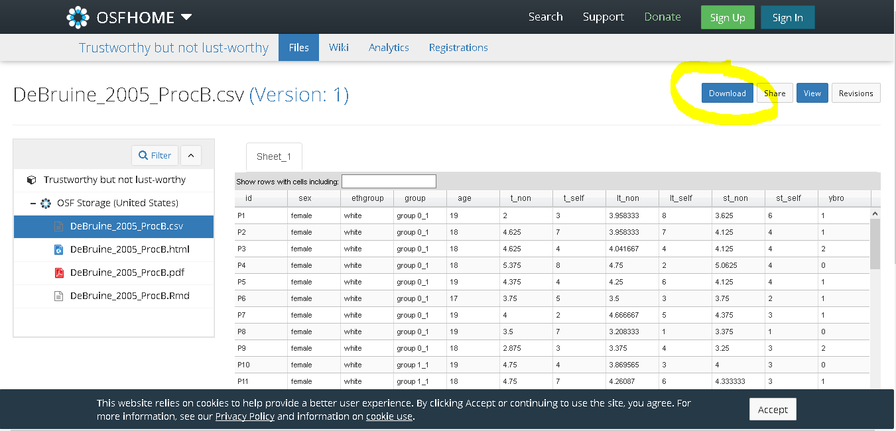

<script src="reveal_extra.js"></script>

```{r setup, include=FALSE}
knitr::opts_chunk$set(echo = TRUE)

library(tidyverse)

```

Now that we are familiar with the setup of R, we can get to the task at hand. We want to process some data and get to the point where we can answer a question that we have from the data.

# Data!

For the purposes of this demonstration let's look at this data from Prof. DeBruine's 2005 paper "Trustworthy but not lust-worthy: Context-specific effects of facial resemblance". The paper and data can be accessed [here](https://osf.io/hcs4a/).

We can download this data directly from the Open Science Foundation (OSF) by clicking on the appropriate file in the "Files" list, the file with the extension ".csv":

<center>  </center> <br> 

This takes us to a new page where you click the "download" button on the top right of the page:

<center>  </center> <br>

## What are .csv files?

Data files are stored in many different formats. One of the more commonly used, disseminated and supported types that you will come across are **C**omma **S**eparated **V**ariable files. 

Again, CSVs are just regular old plain text files, but the file extension tells associated programs what to do with it. Let's look at the file in two programs, notepad and excel, and compare the differences:

<center>  </center> <br>

This is exactly the same file. We can see that it is a plain text file, but that Excel understands that the commas separate the variables (they are "delimited" by the commas). 

Now we just need to move it into R, and we do this using the function `read_csv()` that we learned in semester 1.

## Prerequistites

Before we can load in the data, make sure you have done the following steps from the previously covered topics:

- opened and saved a new script or RMarkdown file in a directory
    - if you are using an RMarkdown file, make sure you have a deleted the example and established a new chunk
- used `library(tidyverse)` to load the Tidyverse package
    - **code is sequential... you need to run the code at the start if code which follows is dependent on it!** Additionally, if you change previous code you need to re-run otherwise changes you have made wont impact the other tasks you have performed "downstream"
- dowloaded the data file into this same directory
- set the working directory using an appropriate method

# read_csv()

## Source of the function

The function `read_csv()` comes from the tidyverse package, so the package must be loaded before it can be used. 

If you try to use it without loading tidyverse you will get an error message:

<center>  </center> 

___ 

**One common error from the homeworks was to use the function `read.csv()` instead of the required `read_csv()`. Whilst these are very similar, they do not create identical objects in the environment when loading in data.**

**Some important differences:**

- `read_csv()` will create a type of object called a "tibble". `read.csv()` creates a "data frame" 
- `read_csv()` is faster when you are using very large data sets
- `read_csv()` does not turn cells with characters into something called "factors" by default, `read.csv()` does. This will become an important consideration in later course content.

**If you are being taught to use one function over another to perform a task then try to stick to that function, it's been set that way for a reason. Try to establish good habits as you learn! :)**

___

## Arguments to the function

### The Help File

Let's have a look at the help file for `read_csv()`:

<center>  </center> <br>

As you can see this help file covers more than the one function we are after. It also covers multiple related functions. This happens in many help files, you just need to refer to the information that you are looking for, rather than the parts which are irrelevant to the current task.

The part we want is below. It names the function and gives the names of the arguments within the brackets. If we scroll down even further we have a section that explains what each argument is and does. These are for all of the functions, so we only need to look at the ones that are mentioned within the brackets of the function we are interested in.

<center>  </center> <br>

Let's have a look at the **input argment** relevant to the function we are using:

- **file**: This is the **input** for the function, in our case it's the file that we downloaded from the OSF.

    _You'll be relieved to hear that this is the only one we are interested in **for now**!_
    
**_The rest make changes to how the function is carried out. You're not required to know about these right now and we don't want to overload you, but if you want more information click the "Reveal More" button below._**

<center><button onclick="revealExtra(extraName = 'CSVMore')">Reveal More: read_csv() arguments</button></center>

<div class="extras" id="CSVMore">

<br>

___

- **col_names**: set to `TRUE` as *default*. Takes the entries of first row of the CSV file and uses them as the column headers.
- **col_types**: set to `NULL` as *default*. 
- **locale**: some information, like formatting of dates and character used to denote decimals, varies by geographical location. This argument lets you change away from the *default* US formats.
- **na**: stands for "not available"... a missing data point! Like if a participant skips a question, we don't know an answer! This argument specifies what represents a missing data point, *default* is "blank" and "NA".
- **quoted_na**: *default* is `TRUE`, treats "" and "NA" also as na
- **quote**: the character which is used as a quotation mark. Default is "... but it looks weird here, represented as \"! The slash tells R it should be looking at " as a character, and *not* as an opening quotation mark. It stops R from looking for the missing closing mark.
- **comment**: a character used to denote a comment. We can set a character that tells R something is a comment in the file, much like # is in your script.
- **trim_ws**: *default* is set to `TRUE`, takes of any spaces at the start or the end of each entry... leading or trailing "**w**hite**s**pace".
- **skip**: allows you to skip a number of rows before R starts reading data. Allows you to skip any nonsense inserted at the start by your data collection platform. 
- **n_max**: allows you to set a maximum number of rows to be read. The *default* is "Inf" (infinite).
- **guess_max**: column types are often guessed. This number lets you set the number of rows that R will use to guess the type of data to be put in a column.
- **progress**: to display a loading progress bar or not- some files really are that size.

___

</div> <br>

# Loading in the data

We want to create an object in our environment which contains the data, we do this by using the follwing code:

```{r}
dat <- read_csv("DeBruine_2005_ProcB.csv")
```

We can break down the code into separate parts to make it easier to understand:

- **dat**: this is the name of the object we will be creating. We don't call it `data` because some names are just not good to use, others are "reserved words" and cannot be used (see `?reserved` for more on these).
- **<-**: the technical term for this is the **assignment operator**. You can read it as "in to". Here it will put the output of the code after it "in to" the object named "dat".
- **read_csv("DeBruine_2005_ProcB.csv")**: this is the function, with the input argument specified as the quoted name of the file to read including the file extension.

See the output starting with "Parsed with column specification:"? This in not an error message, but a notification. It gives you a breakdown how R "sees" each of the columns and the types of data stored within. 

Data "types" are read automatically. Here our columns are of the types:

- **col_character()**: character "strings", saved as characters, even if it contains a character which represents a number.
- **col_double()**: a "double precision" number, a number that represents a fractional value (i.e. can contain decimals)
- **col_integer()**: a "whole" number, not fractional, cannot contain decimal values

# Our Variables

Let's have a look at what we have just loaded into R... our variables are:

- **id**: an ID number assigned to each participant
- **sex**: self-identified sex of the participant
- **ethgroup**: self-identified ethnic group of the participant
- **group**: group assignment based on ethnic group and sex
- **age**: age of participant at time of the study
- **t_non**: times participant picked a non-self-resenbling facial morph as being more trustworthy
- **t_self**: times participant picked a self-resembling facial morph as being more trustworthy
- **st_non**: times participant picked a non-self-resenbling facial morph as being more attractive for a short term relationship
- **st_self**:times participant picked a self-resenbling facial morph as being more attractive for a short term relationship
- **y_bro**: number of younger brothers the participant has
- **y_sis**: number of younger sisters the participant has
- **o_bro**: number of older brothers the participant has
- **o_sis**: number of younger brothers the participant has

Non-self-resembling faces were used as a control, as previous findings have shown that the process of creating facial morphs creates an average of a number of faces which might be more attractive just by virtue of their averageness!

## Aims

Evolutionary theories suggest that we should find self-resembling faces more trustworthy and increase trusting behaviour as a cue of kinship ("inclusive fitness" theory) but less attractive as mating partners in short term mating contexts due to potential detrimental genetic impact on resulting offspring ("optimal outbreeding" theory). In fact, this is exactly the relationship found by Prof. DeBruine. 

We are going to do a few things:

- prepare the R environment for work (loading data, packages, setting up the session etc.)
- calculate a **"self-preference score"** for self-resembling faces ("self" score minus "non" score, or rather the target minus control)
- calculate statistics that describe our participant sample characteristics (**"descriptive statistics"**)
- **plot the self-preference scores** to examine if it looks like there is a relationship between those for trustworthiness and short term mating contexts

## Our research question

**Is there a relationship between self-preference scores for trustworthiness and self-preference scores for short term mating contexts?**

### Points to remember

- We are using the *tidyverse* `read_csv()`, **not** the base `read.csv()`.
- <span style="color:red">Not all red text is an error message!</span>
    - important messages are in red text
    - some important messages are errors, but not all (explain the differences between errors, warnings and important information)
    - it is important to read error messages- most of the time they give hints as to what has gone wrong!


___

Now that we have our data and a research question, lets get on to some pre-processing.

<center> [filter(): removing rows based on some criteria](filter.html) </center>
